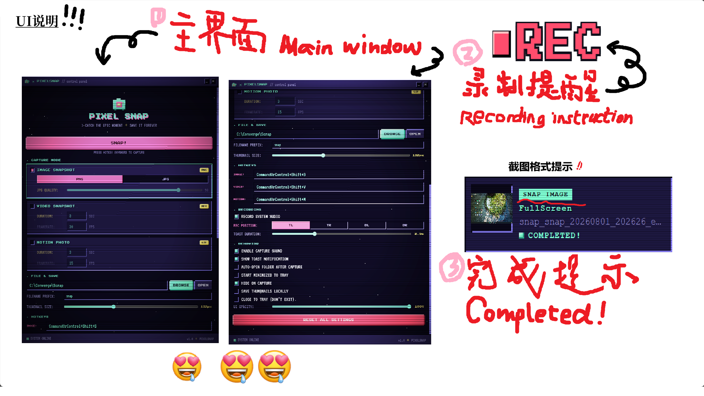

<p align="center">
  
</p>

<h1 align="center">PixelSnap · 像素快拍</h1>

<p align="center">
  像素CRT风格的 Windows 截图、录屏、GIF动图捕获工具<br>
  （个人独立开发作品）
</p>

<p align="center">
  
  
  
  
  
</p>

<p align="center">中文 | <a href="README.en.md">English</a></p>

---

##  ❤️核心创新

- 取消了传统截图的**框选步骤**
- 使用**自动定位**选中窗口，排除windows**制式菜单栏**（窗口上面的白边，有进程名称和横方叉的那个），捕捉窗口**客户区**进行录制
- 根据**应用名称**创建**文件夹**分类保存
>*作者的话：  
&emsp;&emsp;本来是想做个工具给galgame截动图（因为想录声音）的，但是我研究了一下移动端普遍适配的jpg和heif动图在windows上不是很好实现，所以转而做了短视频截图+gif动图  
&emsp;&emsp;AI时代轮椅来的，我一行html和rust都不会写，但这都没关系，只要会拷打agent就够了*

## ✨ 功能特性

- 🖼️ **截图** — 支持 PNG/JPG 格式，JPG 可自定义压缩质量
- 🎬 **视频录制** — H.264 硬件加速 MP4 录制，支持系统音频捕获
- 🎞️ **动图（GIF）** — 可配置时长和帧率的 GIF 动图捕获
- ⌨️ **全局快捷键** — 三种模式独立快捷键，可自定义
- 🎨 **CRT复古界面** — 像素美术风格，动态星空背景，扫描线效果
- 🌠 **流星辉光** — 流星会划过主界面并照亮前台 UI，背景与界面联动
- 📁 **自定义保存路径** — 通过浏览对话框选择输出文件夹
- 🪟 **系统托盘** — 最小化到托盘，托盘菜单快速捕获
- 🔴 **录制状态 Toast** — REC 与完成提示整合在同一个弹窗中，不再使用独立 REC 小窗
- 🖼️ **缩略图** — 可选生成缩略图，尺寸可调
- 🔔 **Toast通知** — 非侵入式完成通知弹窗
- 🎵 **音效** — 可选捕获触发提示音
- 🔧 **高度可配置** — 格式、质量、时长、帧率、透明度等丰富设置  
- 📂 **分类配置** — config.json 按 mode / output / hotkeys / recording / appearance / behavior 分类保存
  <br>
> *不仅支持三种格式，还有如此别具一格的界面？！爱了爱了*

## 🖥️ 界面预览

**像素快拍（PixelSnap）** 采用复古CRT像素美术风格，薄荷绿/粉色/黄色配色，黑色星空动态背景，扫描线效果。  




## 🚀 快速开始

### 下载预编译版本

从 [Releases](../../releases) 页面下载最新的 `PixelSnap.exe`。

### 从源码编译

**前置要求：**
- Windows 10/11
- [Rust](https://www.rust-lang.org/tools/install)（1.85+）
- MSVC 编译工具（通过 Visual Studio Installer 安装）
- Windows 10/11 SDK（用于 Windows Graphics Capture API）
- [Node.js](https://nodejs.org/)（仅开发时需要，release构建不需要）

```powershell
# 克隆仓库
git clone https://github.com/YOUR_USERNAME/PixelSnap.git
cd PixelSnap

# 构建release版本
cd src-tauri
cargo build --release

# 生成的可执行文件路径：
# src-tauri\target\release\pixelsnap.exe
```

## ⌨️ 默认快捷键

| 模式 | 默认快捷键 |
|------|-----------|
| 截图 | `Ctrl+Shift+S` |
| 视频录制 | `Ctrl+Shift+V` |
| 动图（GIF） | `Ctrl+Shift+M` |

快捷键可在设置中自定义。

## 📁 输出格式

- **图片**：`PNG`（无损）+ `JPG`（质量1-100可调）
- **视频**：`MP4`（H.264视频 + AAC音频，通过 Windows Media Foundation 硬件加速编码）
- **动图**：`GIF`（动画）

## ⚙️ 配置说明

所有设置均可在UI中调整，配置文件保存于：
```
%APPDATA%\PixelSnap\config.json
```

**主要设置项包括**：
- 保存目录路径
- 文件名前缀
- 图片格式与质量
- 视频时长与帧率
- GIF时长与帧率
- 窗口/UI 透明度（0%-100%，100% 为不透明）
- 启动行为（最小化到托盘）
- 捕获后自动打开文件夹
- Toast通知开关
- 系统音频录制开关

## 🏗️ 技术栈

- **[Tauri 2](https://tauri.app/)** — 桌面应用框架
- **[Rust](https://www.rust-lang.org/)** — 后端捕获、编码、系统集成
- **[Windows Graphics Capture API](https://learn.microsoft.com/zh-cn/windows/uwp/audio-video-camera/screen-capture)** — 高性能屏幕/窗口捕获
- **[Windows Media Foundation](https://learn.microsoft.com/zh-cn/windows/win32/medfound/microsoft-media-foundation-sdk)** — H.264硬件视频编码
- **WASAPI** — 系统音频捕获
- **HTML/CSS/JS** — 前端UI（零依赖，原生JS）
- **[image](https://crates.io/crates/image)** — 图片编码（PNG/JPG/GIF/ICO）
- **[windows-rs](https://github.com/microsoft/windows-rs)** — Windows API绑定
- **[windows-capture](https://github.com/phantom-software-ak/windows-capture)** — WGC Rust绑定

## 📁 项目结构

```
PixelSnap/
├── dist/                      # 前端静态文件（HTML/CSS/JS）
│   ├── index.html             # 主设置界面
│   ├── app.js                 # 前端逻辑
│   └── toast.html             # Toast通知弹窗
├── src-tauri/
│   ├── src/
│   │   ├── main.rs            # 应用入口、托盘、窗口管理、IPC命令
│   │   ├── capture.rs         # 核心捕获逻辑（图片/视频/GIF）
│   │   ├── config.rs          # 配置管理
│   │   ├── audio.rs           # 音频捕获（WASAPI）
│   │   ├── log.rs             # 日志（%APPDATA%\PixelSnap\logs）
│   │   └── toast.rs           # Toast窗口辅助
│   ├── icons/                 # 应用图标（由build.rs构建时自动生成）
│   ├── capabilities/          # Tauri权限配置
│   ├── Cargo.toml             # Rust依赖配置
│   ├── Cargo.lock             # Rust依赖锁定文件
│   ├── build.rs               # 构建脚本（图标自动生成）
│   └── tauri.conf.json        # Tauri应用配置
├── .gitignore                 # Git忽略规则
├── LICENSE                    # MIT开源协议
└── README.md                  # 项目说明
```

## 🤝 参与贡献

欢迎贡献代码！你可以：

1. Fork 本仓库
2. 创建特性分支（`git checkout -b feature/amazing-feature`）
3. 提交更改（`git commit -m 'Add some amazing feature'`）
4. 推送到分支（`git push origin feature/amazing-feature`）
5. 提交 Pull Request

## 📜 开源协议

本项目基于 MIT 协议开源 — 详见 [LICENSE](LICENSE) 文件。

## ⚠️ 仅支持Windows

本应用使用 Windows 特有API（Windows Graphics Capture、Media Foundation、WASAPI），专为 Windows 10 1903+ 和 Windows 11 设计。暂无跨平台支持计划。

## 🙏 致谢

- [Codex](https://openai.com/codex/) — 桌面端 AI 结对编程助手
- [DeepSeek-V4-Flash-0731](https://huggingface.co/deepseek-ai/DeepSeek-V4-Flash-0731) — 提供模型能力支持
- [Trae](https://www.trae.ai/) — 本项目使用 Trae AI SOLO 辅助开发完成，AI 结对编程极大提升了开发效率
- [Tauri](https://tauri.app/) — 优秀的桌面应用框架
- [windows-rs](https://github.com/microsoft/windows-rs) — 微软官方Rust Windows绑定
- [windows-capture](https://github.com/phantom-software-ak/windows-capture) — WGC Rust绑定库
